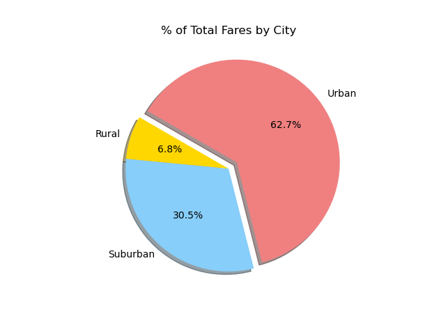

# PyBer Ride-Sharing Analysis
### Overview
By using PyBer data ranging from January 2019 to April 2019, this analysis analyses how the ride-sharing data differs per city type, and how these differences can be used used to improve the PyBers standings and profits.

### Results
#### Summary
The analysis of ride-sharing data found that out of all the city types, Urban cities generate the most overall revenue, and Rural cities generate the most revenue per driver. 

#### PyBer generated a total profit of $58,345 in Q1 of 2019. (January - April)

| City Type  | Profit | Average Per Week |
| ------------- | ------------- | ------------- |
| Urban  | $36,737  |  $2,161  |
| Suburban  | $17,694  |  $1,040   |
| Rural  | $3,913  |  $230  |
| **Total**  | **$58,345**  |  **$3,432**  |

#### The total drivers by city types were highest in Urban city types and lowest in Rural city types.

#### The total rides versus the number of drivers were higher in Suburban and Rural cities but lower in Urban cities.

#### The fare profits compared to the number of drivers and the number of rides were higher in both Rural and Suburban cities, while lower in Urban cities.

### Recommendations

##### Urban
- As the number of total rides is greater than the total drivers, many drivers are found without rides. One way to balance out these disproportions can be to lower the driver revenue, thus decreasing the number of drivers in an oversaturated market, to average out the total rides by total drivers.

##### Suburban
- As the total rides in Suburban cities are around twice as high as the total drivers, the driver revenue per ride can be increased to promote more drivers to sign up, thus increasing ride availability and reducing potential customer wait times caused by the lack of drivers.

##### Rural
- The weekly revenue average in Rural cities is fairly low compared to Urban and Suburban cities. One of the factors can be the cost per mileage. Customers may need to travel further distances to reach their destinations. To increase the revenue generated in Rural cities, the cost per mileage can be lowered to increase customer attraction and popularity.
